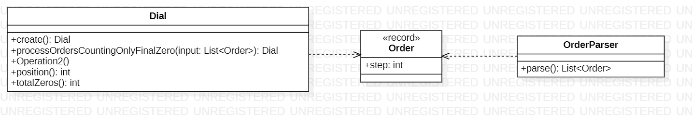

# Day 1

## 1. Visión General
Este sistema simula el comportamiento de un dial circular de 100 posiciones. El desafío consiste en procesar una serie de instrucciones de movimiento ("Orders") y contabilizar cuántas veces el dial se detiene o atraviesa la posición cero. La solución evoluciona de un conteo de posición final (Parte A) a un seguimiento de trayectoria completa (Parte B).

---

## 2. Arquitectura y Principios de Diseño

### Fundamentos Aplicados
* **Estado Inmutable**: La clase `Dial` es inmutable. Cada operación de movimiento no modifica el objeto existente, sino que devuelve una nueva instancia de `Dial` con la posición y el contador actualizados.
* **Single Responsibility (SRP)**:
    * `Order`: Simple contenedor de datos para una instrucción.
    * `OrdersParser`: Centraliza la lógica de interpretación de comandos ('L' para negativo, 'R' para positivo).
    * `Dial`: Encapsula la aritmética modular necesaria para un sistema circular.
* **Aritmética Modular Robusta**: Implementación de normalización para asegurar que las posiciones siempre se mantengan en el rango $[0, 99]$, incluso con desplazamientos negativos.

### Principios de Diseño
* **Inyección de Comportamiento vía Streams**: El uso de `reduce` en Java Streams permite tratar la lista de órdenes como una transformación de estado continua, donde el "acumulador" es el propio objeto `Dial`.
* **Encapsulamiento de Lógica Matemática**: Los detalles de cómo se calculan los cruces por cero están ocultos tras métodos expresivos como `applyAnyClick` y `applyLeftPointing`.

---

## 3. Patrones y Técnicas Avanzadas

* **Patrón State (Inmutable)**: El sistema funciona como una máquina de estados donde cada instrucción de entrada dispara una transición a un nuevo estado inmutable.
* **Reducción de Flujos (Stream Reduction)**:
    * El método `processOrdersCountingOnlyFinalZero` utiliza `.reduce(this, Dial::applyLeftPointing, ...)` para colapsar una lista de movimientos en un resultado único.
* **Simulación de Trayectoria**: Para la Parte B, se implementó `countZeroHitsWhileMoving`, que discretiza el movimiento paso a paso para no perder ningún cruce por el punto de origen (posición 0).
* **Static Factory Method**: `Dial.create()` proporciona un punto de inicio estandarizado (posición 50, contador 0).

---

## 4. Diagrama de Clases (UML)

*El diagrama muestra una arquitectura , donde el `Dial` actúa como el núcleo del modelo, apoyado por un parser especializado.*