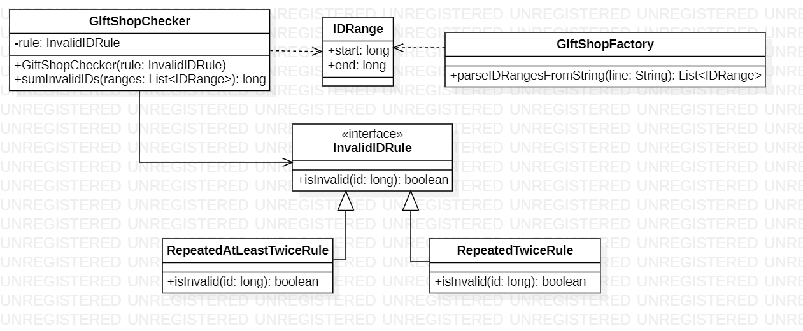

# Day 2

## 1. Visión General
Este sistema gestiona la validación de identificadores (IDs) dentro de rangos específicos para una tienda de regalos. El objetivo es identificar IDs "inválidos" basándose en patrones de repetición numérica. La arquitectura permite alternar entre diferentes criterios de invalidez sin modificar el motor de procesamiento principal.

---

## 2. Arquitectura y Principios de Diseño

### Fundamentos Aplicados
* **Patrón Strategy**: Se define la interfaz `InvalidIDRule` como una estrategia intercambiable. `GiftShopChecker` no sabe *cómo* se valida un ID, solo sabe que debe aplicar la regla proporcionada.
* **Inyección de Dependencias (DI)**: La regla concreta (`RepeatedTwiceRule` o `RepeatedAtLeastTwiceRule`) se inyecta a través del constructor de `GiftShopChecker`. Esto facilita enormemente el testing y la extensión del sistema.
* **Polimorfismo**: Las clases `RepeatedTwiceRule` y `RepeatedAtLeastTwiceRule` implementan la misma interfaz, permitiendo que el checker las trate de forma uniforme.

### Principios de Diseño
* **Open/Closed Principle (OCP)**: El sistema está **abierto** a nuevas reglas de validación (solo hay que crear una nueva clase que implemente la interfaz) pero **cerrado** a modificaciones en el checker.
* **Single Responsibility (SRP)**:
    * `IDRange`: Solo almacena los límites de un intervalo.
    * `InvalidIDRule`: Se encarga exclusivamente de la lógica de validación mediante expresiones regulares.
    * `GiftShopFactory`: Centraliza la lógica de parsing de strings a objetos de dominio.

---

## 3. Patrones y Técnicas

* **Expresiones Regulares**: Se utiliza el patrón `(.+)\\1` para detectar repeticiones exactas de dígitos de forma eficiente.
* **Procesamiento de Flujos (Streams & FlatMap)**:
    * `flatMapToLong`: Se utiliza para "aplanar" múltiples rangos en un único flujo continuo de IDs individuales.
    * `LongStream.rangeClosed`: Genera de forma eficiente la secuencia de números dentro de cada rango para su posterior filtrado.
* **Data Transfer Objects (DTO)**: El uso de `record` para `IDRange` proporciona una estructura de datos inmutable y concisa, ideal para representar intervalos de entrada.
* **Separación de Capas**: El código distingue claramente entre la carga de datos (`OrdersLoader`), la creación de modelos (`GiftShopFactory`) y el cálculo de resultados (`GiftShopChecker`).

---

## 4. Diagrama de Clases (UML)

*El diagrama muestra cómo `GiftShopChecker` depende de la abstracción `InvalidIDRule`, permitiendo la coexistencia de múltiples reglas concretas.*