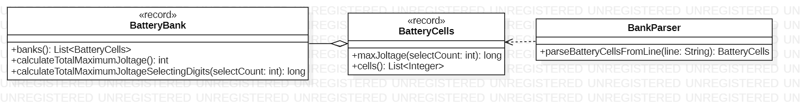

# Day 3

## 1. Visión General
Este sistema calcula el "voltaje" (joltage) máximo de un banco de baterías procesando secuencias de dígitos. El reto principal consiste en extraer la subsecuencia más grande posible de longitud $K$ manteniendo el orden original, lo que requiere un algoritmo eficiente de eliminación de elementos.

---

## 2. Arquitectura y Principios de Diseño

### Fundamentos Aplicados
* **Composición sobre Herencia (COI)**: Un `BatteryBank` está compuesto por una lista de `BatteryCells`. Esta estructura de "todo-parte" permite escalar el cálculo del total de forma sencilla mediante agregación.
* **Single Responsibility (SRP)**:
    * `BankParser`: Únicamente se encarga de transformar texto crudo en tipos numéricos.
    * `BatteryCells`: Gestiona la lógica interna de optimización de una celda individual.
    * `BatteryBank`: Coordina los resultados de múltiples celdas para obtener el valor global.
* **Records para el Dominio**: El uso de `record` para `BatteryBank` y `BatteryCells` garantiza que los datos de los sensores de las baterías sean inmutables una vez leídos.

### Principios de Diseño
* **Flexibilidad**: Aunque la Parte A pide seleccionar 2 dígitos, el método `calculateTotalMaximumJoltageSelectingDigits(int selectCount)` está diseñado para aceptar cualquier tamaño, facilitando la evolución del sistema.

---

## 3. Patrones y Técnicas

* **Pila (Stack)**: Para encontrar la subsecuencia máxima, se utiliza una estrategia de pila donde se eliminan elementos menores conforme llegan dígitos mayores, siempre que el presupuesto de "descarte" (`drop`) lo permita.
* **Algoritmo Greedy (Codicioso)**: El sistema toma la mejor decisión local en cada paso (mantener el dígito más alto posible a la izquierda) para asegurar el máximo valor global.
* **Procesamiento de Flujos (Java Streams)**:
    * Uso de `chars().map()` para una conversión eficiente de caracteres a valores numéricos en `BankParser`.
    * Uso de `mapToLong().sum()` en `BatteryBank` para procesar grandes volúmenes de datos de forma declarativa.
* **Conversión de Base Numérica**: La lógica para reconstruir el número final (`result * 10 + d`) demuestra un manejo eficiente de acumuladores sin necesidad de manipular Strings costosos.

---

## 4. Diagrama de Clases (UML)

*El diagrama ilustra la relación jerárquica entre el banco y sus celdas, así como el flujo de datos desde el parser hacia el modelo de dominio.*