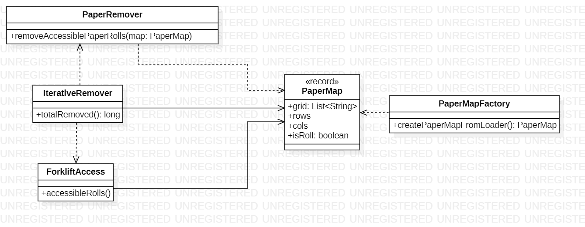

# Day 4

## 1. Visión General
Este sistema simula la retirada de rollos de papel en un almacén basándose en criterios de accesibilidad para carretillas elevadoras. El problema evoluciona de un simple conteo de elementos accesibles (`ForkliftAccess`) a un proceso de remoción en cascada donde la retirada de un rollo puede habilitar la accesibilidad de otros.

---

## 2. Arquitectura y Principios de Diseño

### Fundamentos Aplicados
* **Inmutabilidad y Transformación**: El mapa del almacén (`PaperMap`) se trata como una estructura inmutable. En lugar de modificar el estado global, la remoción genera nuevos estados de cuadrícula a través de la clase `PaperRemover`.
* **Single Responsibility (SRP)**:
    * `PaperMap`: Solo conoce la estructura de la cuadrícula y cómo identificar un rollo (`@`).
    * `ForkliftAccess`: Contiene exclusivamente la lógica geométrica para determinar si un espacio es accesible.
    * `IterativeRemover`: Orquesta el proceso hasta alcanzar un estado estable.
* **Records para Datos**: El uso de `record` para `PaperMap` garantiza que la estructura de la cuadrícula no cambie inesperadamente durante el procesamiento de los Streams.

### Principios de Diseño
* **Separación de Lógica y Estado**: La lógica de accesibilidad no vive dentro de la cuadrícula, sino en un servicio separado (`ForkliftAccess`), permitiendo que el sistema sea más flexible ante cambios en las reglas de negocio de la carretilla.
* **Encapsulamiento de Creación**: `PaperMapFactory` abstrae la complejidad de transformar el flujo de entrada en una estructura de datos lista para ser procesada.

---

## 3. Patrones y Técnicas
* **Functional Programming (Streams)**:
    * Se utilizan `IntStream` para recorrer la cuadrícula de forma declarativa, lo que facilita la legibilidad y permite una futura paralelización del cálculo de accesibilidad.
* **Factory Method**: El uso de `createPaperMapFromLoader` centraliza la carga de datos, facilitando el intercambio de fuentes de datos (archivos, red, etc.).

---

## 4. Diagrama de Clases (UML)

*El diagrama muestra una clara jerarquía donde los servicios de lógica (`ForkliftAccess`, `IterativeRemover`) consumen el modelo de datos (`PaperMap`), manteniendo una arquitectura limpia y extensible.*
