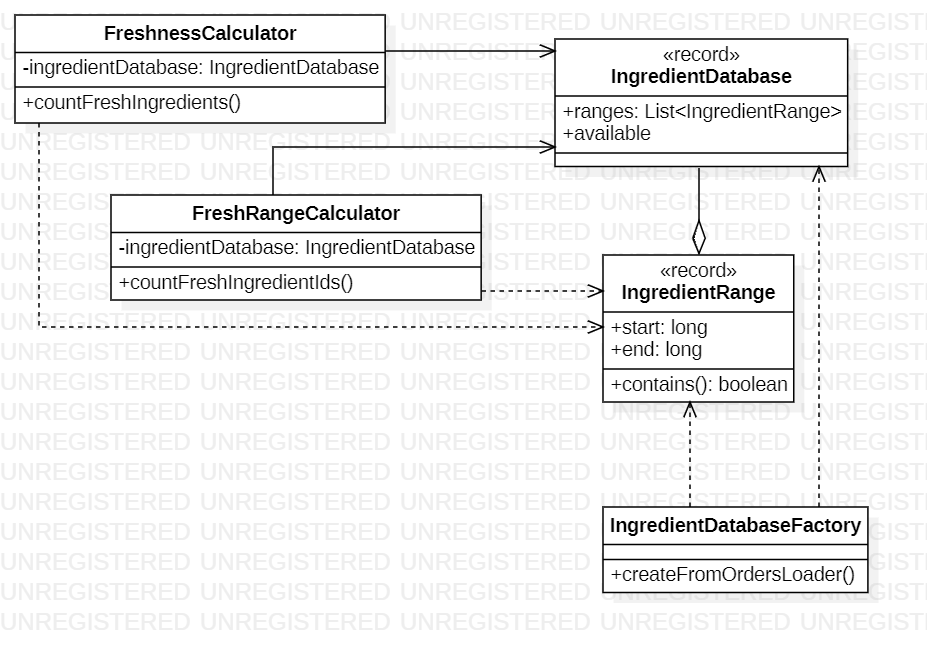

# Day 5

## 1. Visión General
Este sistema gestiona inventarios de ingredientes basados en identificadores numéricos y rangos de frescura. El desafío evoluciona de verificar si IDs específicos están dentro de ciertos rangos (`FreshnessCalculator`) a calcular el total de IDs únicos cubiertos por múltiples intervalos que pueden solaparse (`FreshRangeCalculator`).

---

## 2. Arquitectura y Principios de Diseño

### Fundamentos Aplicados
* **Desacoplamiento de Lógica de Negocio**: La base de datos de ingredientes (`IngredientDatabase`) es puramente una estructura de datos, mientras que la lógica de cálculo se delega a servicios especializados como `FreshnessCalculator` y `FreshRangeCalculator`.
* **Single Responsibility (SRP)**:
    * `IngredientRange`: Único responsable de conocer sus límites y validar la inclusión de un ID.
    * `IngredientDatabaseFactory`: Centraliza la lógica de parsing del archivo de órdenes, aislando al resto del sistema del formato de entrada.
* **Inmutabilidad con Records**: Se utilizan `record` para `IngredientDatabase` e `IngredientRange`, asegurando la integridad de los datos durante procesos de ordenamiento y filtrado masivo.

### Principios de Diseñ
* **Separación de Intereses (SoC)**: Se separa claramente la persistencia/carga de datos de la lógica algorítmica de resolución de intervalos.
* **Encapsulamiento**: La lógica interna de cómo se fusionan los rangos en la Parte B queda oculta dentro de `FreshRangeCalculator`, exponiendo solo el resultado final.

---

## 3. Patrones y Técnicas

* **Algoritmo de Fusión de Intervalos (Interval Merging)**: Para la Parte B, en lugar de iterar por cada ID individualmente (lo cual sería ineficiente), el sistema ordena los rangos por su inicio y calcula la cobertura neta, manejando solapamientos.
* **Static Factory Method**: `IngredientDatabaseFactory` proporciona un punto de entrada limpio para la creación del modelo de dominio desde un `OrdersLoader`.
* **Programación Funcional (Java Streams)**:
    * **Filtrado Dinámico**: Uso de `Predicate` y `anyMatch` en `FreshnessCalculator` para validar ingredientes.
    * **Transformación de Datos**: Procesamiento de líneas y splits mediante Streams para construir objetos de dominio de manera fluida.
---

## 4. Diagrama de Clases (UML)

*El diagrama refleja una arquitectura de servicios donde los calculadores dependen de un modelo de datos compartido y estable.*