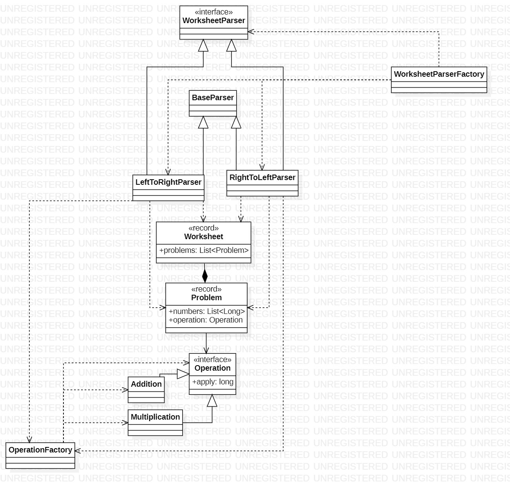

# Day 6

## 1. Visión General
Este sistema procesa "hojas de trabajo" (Worksheets) que contienen problemas matemáticos distribuidos en columnas. El desafío reside en la extracción de datos desde formatos de texto no estructurados, utilizando dos estrategias de lectura distintas según la dirección del flujo de datos (izquierda a derecha y derecha a izquierda).

---

## 2. Arquitectura y Principios de Diseño

### Fundamentos Aplicados
* **Herencia y Reutilización**: Se utiliza una clase abstracta `BaseParser` para centralizar la lógica común de preprocesamiento (limpieza de líneas, cálculo de ancho y *padding* de texto), evitando la duplicación de código.
* **Polimorfismo**: Ambos parsers implementan la interfaz `WorksheetParser`, lo que permite al sistema tratar cualquier estrategia de análisis de forma uniforme.
* **Patrón Strategy**: La lógica de extracción de problemas es intercambiable. El sistema decide qué "estrategia" usar mediante una factoría.

### Principios de Diseño
* **Open/Closed Principle (OCP)**: El sistema está diseñado para integrar nuevas direcciones de lectura o formatos de problemas simplemente añadiendo una nueva implementación de `WorksheetParser`, sin modificar el modelo de datos existente.
* **Single Responsibility (SRP)**:
  * `Operation`: Define exclusivamente el contrato para cálculos matemáticos.
  * `Problem`: Se encarga de la lógica de resolución de un bloque de números y su operación.
* **Dependency Inversion**: Las clases de alto nivel (`Day06A/B`) dependen de la abstracción `WorksheetParser`, no de las implementaciones concretas `LeftToRightParser` o `RightToLeftParser`.

---

## 3. Patrones y Técnicas

* **Simple Factory Pattern**: `OperationFactory` encapsula la lógica de creación de operaciones basadas en símbolos (`+`, `*`), centralizando la gestión de errores para símbolos desconocidos.
* **Static Factory Method**: `WorksheetParserFactory` proporciona métodos semánticos (`partA()`, `partB()`) para obtener la instancia correcta del parser, mejorando la legibilidad del cliente.
* **Programación Declarativa (Streams)**:
  * En `Addition` y `Multiplication`, se utilizan Streams para reducir colecciones de números a un único resultado de forma concisa.
  * En `Worksheet`, el cálculo del total se realiza mediante un flujo funcional sobre la lista de problemas.
* **Refactorización de Código Común**: El uso de `BaseParser` permite que las clases hijas se enfoquen únicamente en el algoritmo específico de su dirección, delegando el manejo de strings a la superclase.

---

## 4. Diagrama de Clases (UML)

*El diagrama muestra la jerarquía de parsers y cómo el modelo de dominio (Worksheet, Problem, Operation) permanece independiente de la estrategia de captura de datos.*