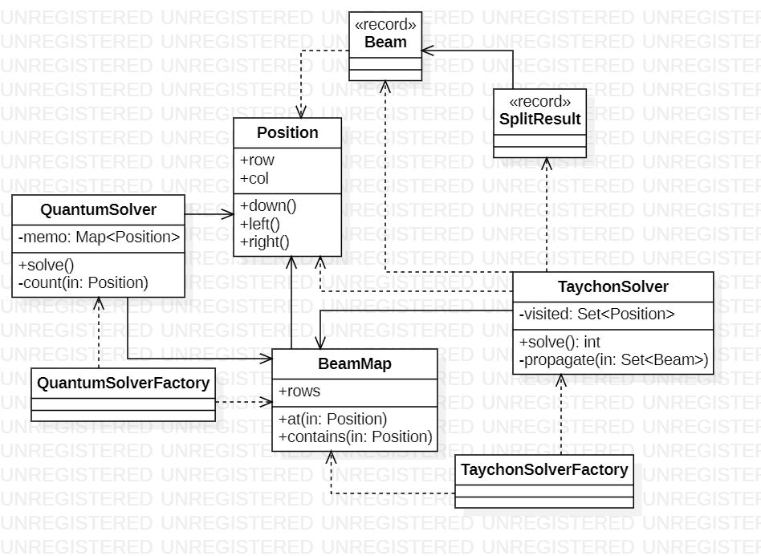

# Day 7

## 1. Visión General
Este sistema modela el flujo de partículas a través de un mapa ("manifold"). El reto evoluciona desde contar bifurcaciones mediante simulación (`TachyonSolver`) hasta calcular el número total de caminos posibles mediante técnicas de optimización cuántica (`QuantumSolver`).

---

## 2. Arquitectura y Principios de Diseño

### Fundamentos Aplicados
* **Separación de Responsabilidades (SRP)**: El dominio se divide en la estructura del mapa (`BeamMap`), el estado de la partícula (`Beam`) y la lógica de resolución (`Solvers`).
* **Inmutabilidad**: Los componentes clave (`Position`, `Beam`, `SplitResult`) están implementados como **Records**, garantizando que los estados intermedios no sufran efectos secundarios durante la recursión.

### Principios de Diseño
* **Tell, Don't Ask**: La lógica de movimiento está encapsulada en `Position` (métodos `down`, `left`, `right`). El solver no calcula coordenadas manualmente, le pide a la posición que genere la siguiente.
* **Cohesión**: `BeamMap` centraliza toda la lógica de validación de límites y acceso a caracteres, evitando que los solvers conozcan la implementación interna de la lista de strings.

---

## 3. Patrones y Técnicas

* **Memoización (Programación Dinámica)**: En `QuantumSolver`, se utiliza un `Map<Position, Long> memo` para almacenar resultados de subproblemas ya resueltos. Esto reduce drásticamente la complejidad computacional de exponencial a lineal.
* **Recursividad de Cola**: El sistema utiliza métodos recursivos para propagar el flujo, manteniendo un código declarativo y fácil de seguir.
* **Estructuras de Datos Inmutables**: `SplitResult` utiliza un patrón de diseño que permite fusionar resultados (`merge`) de diferentes ramas de ejecución de forma segura.
* **Switch**: Uso de sentencias `switch` para determinar el comportamiento del flujo según el carácter del mapa (`^`, `default`), mejorando la legibilidad.

---

## 4. Diagrama de Clases (UML)

*El diagrama ilustra cómo ambos solvers dependen del modelo común de BeamMap y Position para ejecutar sus respectivas estrategias de resolución.*
