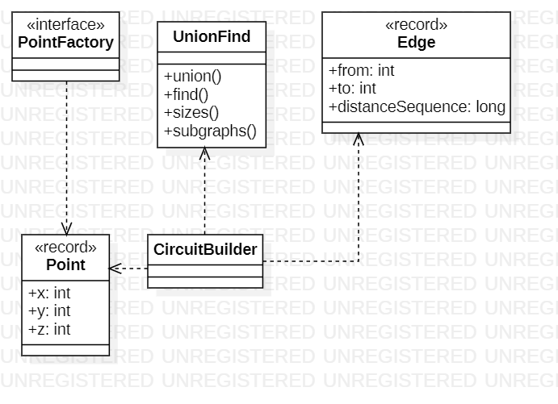

# Day 8

## 1. Visión General
Este sistema resuelve un problema de conectividad espacial y optimización de redes (MST). Utiliza algoritmos de grafos para determinar cómo se agrupan diferentes puntos en el espacio y calcular productos basados en el tamaño de estos componentes o en las propiedades de las aristas que los conectan.

---

## 2. Arquitectura y Principios de Diseño

### Fundamentos Aplicados
* **Modularidad**: Separación lógica entre la gestión de la conectividad (`UnionFind`), la construcción de la red (`CircuitBuilder`) y las entidades de datos (`Point`, `Edge`).
* **Abstracción**: `CircuitBuilder` abstrae la complejidad de los algoritmos de grafos (Kruskal-like), ofreciendo métodos de alto nivel como `calculateMST` o `componentSizes`.
* **Alta Cohesión**: La clase `UnionFind` tiene una única responsabilidad: gestionar conjuntos disjuntos y sus fusiones de forma eficiente.

### Principios de Diseño
* **Single Responsibility (SRP)**:
  * `PointFactory`: Única responsable de la deserialización de archivos CSV a objetos `Point`.
  * `Edge`: Record dedicado exclusivamente a representar la relación y distancia entre dos nodos.
* **Inmutabilidad**: Uso de `record` para `Point` y `Edge`, asegurando que las coordenadas y distancias no cambien durante los cálculos.
* **Encapsulamiento**: El estado interno del árbol de Union-Find (`parent`, `size`) está protegido, exponiendo solo el comportamiento necesario para unir y contar subgrafos.

---

## 3. Patrones y Técnicas

* **Static Factory Method**: Implementado en `PointFactory` para centralizar la creación de listas de puntos desde el cargador de órdenes.
* **Programación Funcional (Streams)**:
  * **Procesamiento de Datos**: En `calculateTop3ComponentProduct`, se utilizan Streams para ordenar, filtrar y reducir (multiply) los tamaños de los componentes de forma declarativa.
  * **Abstracción de Lógica**: Los Streams permiten expresar la intención ("dame el producto de los 3 más grandes") sin bucles anidados manuales.
* **Algoritmo**: Implementación de la lógica de Minimum Spanning Tree (MST) para construir la red mínima necesaria.

---

## 4. Diagrama de Clases (UML)

*El diseño destaca la dependencia de CircuitBuilder hacia UnionFind para resolver problemas de conectividad de nodos.*
