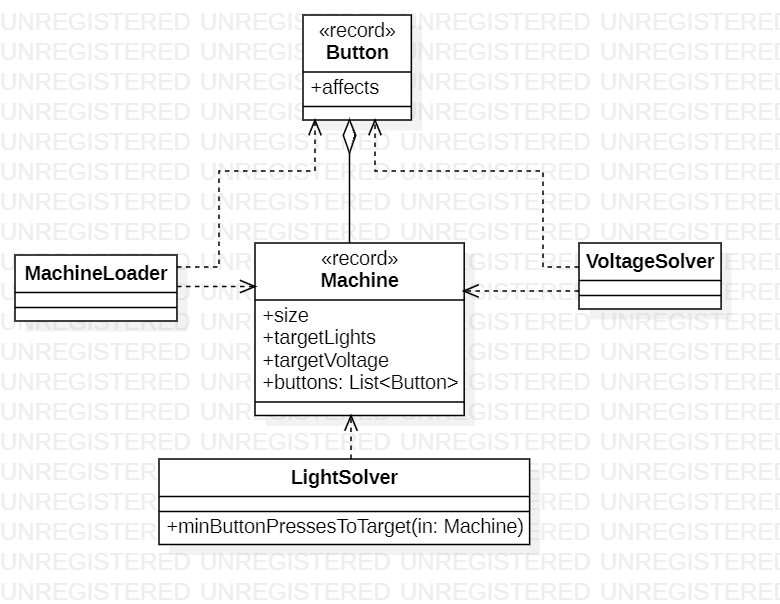

# Day 10

## 1. Visión General
Este sistema resuelve un problema de optimización combinatoria: encontrar la cantidad mínima de pulsaciones de botones para alcanzar un estado objetivo (luces o voltajes). La arquitectura separa la infraestructura de carga de datos de los algoritmos específicos de resolución (**Solvers**).

---

## 2. Arquitectura y Principios de Diseño

### Fundamentos Aplicados
* **Modularidad**: El sistema se divide en tres paquetes claros: `a` (lógica de luces), `b` (lógica de voltajes) y `model` (dominio común).
* **Abstracción**: Los solvers (`LightSolver`, `VoltageSolver`) abstraen algoritmos complejos (Bitmasking y Programación Dinámica) detrás de métodos simples como `minButtonPressesToTarget`.
* **Bajo Acoplamiento**: `MachineLoader` actúa como un puente entre el texto plano y los objetos de dominio, permitiendo que el resto del sistema no sepa nada sobre el formato de entrada.

### Principios de Diseño
* **Single Responsibility (SRP)**:
  * `MachineLoader`: Única responsable del parseo mediante expresiones regulares.
  * `LightSolver`: Especializada en problemas de estados binarios (luces ON/OFF).
  * `VoltageSolver`: Especializada en estados acumulativos (voltaje).
* **Inmutabilidad**: Uso de `Record` para `Button` y `Machine`, asegurando que los datos del problema no muten durante la ejecución del algoritmo.
* **Open/Closed Principle (OCP)**: El diseño permite añadir un nuevo tipo de solver (ej. `TemperatureSolver`) extendiendo la lógica sin modificar el `MachineLoader` o los modelos base.

---

## 3. Patrones y Técnicas

* **Static Factory Method**: `MachineLoader` centraliza la creación de objetos complejos de dominio, ocultando la complejidad de los `Matcher` y `Regex`.
* **Programación Funcional (Streams)**:
  * **Simplificación de Resultados**: En `Day10A`, se utiliza un Stream para mapear cada máquina a su solución y sumarlas en una sola línea.
  * **Transformación de Datos**: En el factory, se usan Streams para convertir strings de índices en `Set<Integer>` de forma declarativa.
* **Técnicas de Optimización**:
  * **Bitmasking**: Uso de operadores a nivel de bits (`<<`, `&`, `^`) en `LightSolver` para una ejecución extremadamente rápida.
  * **Memoización/Caché**: `VoltageSolver` utiliza un `Map` como caché para evitar recalcular estados ya visitados en la recursión.

---

## 4. Diagrama de Clases (UML)

*La arquitectura destaca por el uso de modelos inmutables y la separación de estrategias de resolución.*
