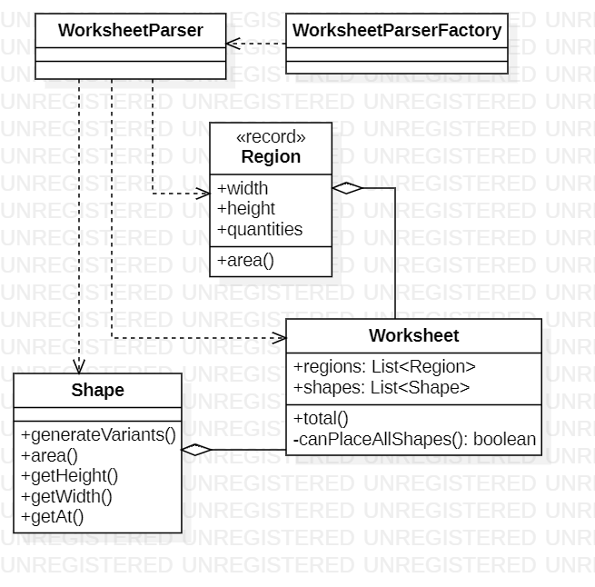

# Day 12

## 1. Visión General
Este proyecto resuelve el problema del Día 12 del Advent of Code, centrándose en la validación de encaje de piezas (**Shapes**) en áreas específicas (**Regions**).

---

## 2. Arquitectura y Principios de Diseño

### Fundamentos Aplicados
* **Alta Cohesión**: Cada clase tiene una responsabilidad única. `Shape` maneja geometría, `Worksheet` la lógica de negocio y `Parser` la transformación de datos.
* **Bajo Acoplamiento**: El uso de interfaces como `OrdersLoader` permite que el sistema no dependa de la implementación específica del sistema de archivos.
* **Código Expresivo**: Se han utilizado nombres de métodos claros como `canPlaceAllShapes` o `generateVariants` para que el código sea autodocumentado.

### Principios SOLID
* **Single Responsibility (SRP)**: Separación total entre la lógica de entrada/salida y la lógica algorítmica.
* **Dependency Inversion (DIP)**: Se inyectan las dependencias (como el Loader) para evitar que módulos de alto nivel dependan de detalles de bajo nivel.
* **Liskov Substitution (LSP)**: El diseño permite intercambiar diferentes cargadores de datos sin afectar el comportamiento de `Day12`.

### Otras Técnicas
* **Tell, Don't Ask**: En lugar de consultar los datos internos de la pieza, se le ordena a `Shape` que genere sus variantes.
* **Inmutabilidad**: Uso de `Record` para `Region` y estados finales en `Shape`, evitando efectos secundarios inesperados.

---

## 3. Patrones de Diseño

* **Factory Method**: Implementado en `WorksheetParserFactory` para centralizar y ocultar la complejidad de creación del parser.
* **Programación Funcional (Streams)**: Utilizados en `Worksheet.total()` para elevar el nivel de **Abstracción**. Los Streams permiten declarar *qué* queremos hacer (filtrar y contar) sin preocuparnos por el *cómo* (bucles manuales), reduciendo así la complejidad cognitiva.
* **Backtracking con Centinela**: El algoritmo recursivo de encaje utiliza un caso base como centinela para finalizar la búsqueda exitosa.

---

## 4. Diagrama de Clases (UML)

*El diagrama refleja separación entre la factoría de creación, el parser y las entidades de dominio.*